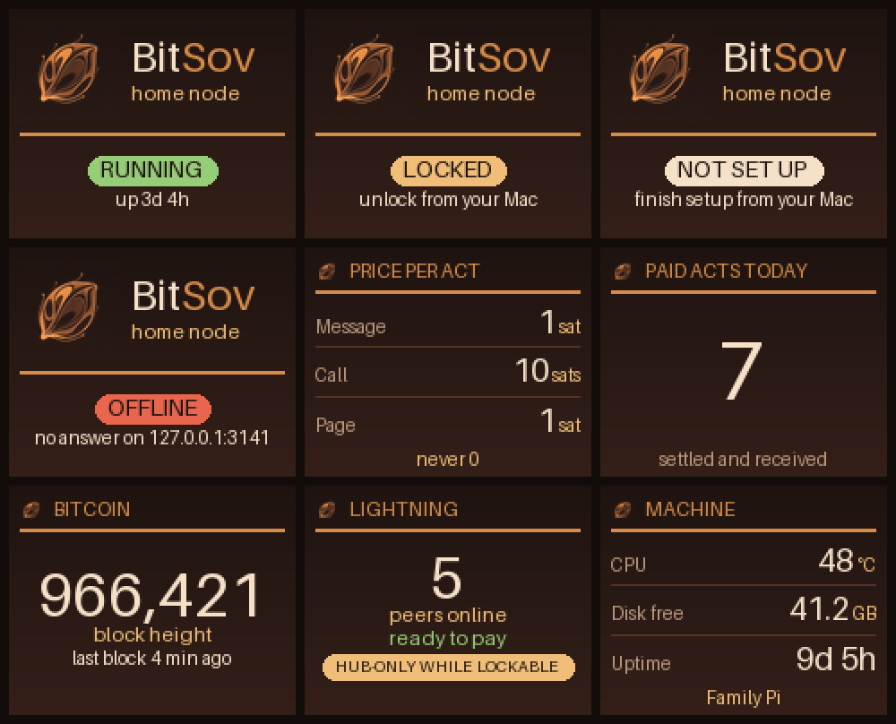

# BitSov front display

A small service for the screen on a Raspberry Pi 4 home node (for example the
ribbon-cable panel in a "Bitcoin Machines" case). It rotates through four
screens, about 8 seconds each:

| Screen | Shows |
| --- | --- |
| logo | The BitSov mark and wordmark, drawn in code |
| status | `LOCKED` with "unlock from your Mac", `Running` with uptime, `Not set up`, or `Node offline` |
| prices | "Price per act": what this node charges a stranger per message kind, in sats |
| host | The `[node].hosted_by` label (or the hostname) and the LAN IP |



Per-panel PNGs are in [`preview/`](preview/).

## What it can and cannot see

The display is built so that it cannot leak custody material, even by mistake.

- **Network:** the service connects only to `127.0.0.1:<api port>`. The code
  uses a raw loopback HTTP connection (no proxies, no redirects), and the
  systemd unit also sets `IPAddressDeny=any` and `IPAddressAllow=localhost`.
- **Endpoints:** `GET /api/v1/node/lock`, then `GET /livez`, then, only if
  `/livez` carries no uptime, the redacted public `GET /api/v1/health`. From
  each answer it keeps only `state`, `uptime_secs` and `hosted_by`, and drops
  everything else before it is stored.
- **konsensus.toml:** opened read-only. A line filter drops every line whose
  key is not on the allow-list before anything is parsed. The allow-list is
  the `[pricing]` `*_msat` keys, `pricing.mode`,
  `payment_gate.min_admission_cost_msat`, `api.listen_addr` and
  `node.hosted_by`. Keys like `jwt_secret`, Lightning credentials and the
  mnemonic path are never parsed.
- **Filesystem:** under systemd, `/home` and `/var/lib` are empty tmpfs
  mounts. Only `konsensus.toml` is mapped back in, read-only
  (`BindReadOnlyPaths`). The seed, pairing records, tickets and wallet do not
  exist in the service's view.
- It never reads or shows the seed, mnemonic, password, pairing links, tickets,
  tokens or balances. It never writes to the node.

### Node states

| Loopback answers | Screen |
| --- | --- |
| Nothing listening | Node offline |
| `/api/v1/node/lock` returns `{"state":"locked"}` | LOCKED, unlock from your Mac |
| `/livez` returns plain `ok` and there is no lock route (first-run bootstrap) | Not set up |
| No lock route (normal unlocked node) | Running, with uptime from `/livez` or `/api/v1/health` |

On Light and Full nodes, `[api].operator_probes_enabled` is off by default, so
`/livez` returns 404 once the node is unlocked. In that case the uptime comes
from the public `/api/v1/health`, which has no balances, keys or peer IDs.

### Price per act

Prices are the node's own `[pricing]` values (millisatoshis, node defaults if
a key is omitted). The display applies the same floor the node uses when it
advertises and accepts payments, `konsensus_core::gate::price_with_floor_msat`:

```
price = max(configured_msat, payment_gate.min_admission_cost_msat, 1000)
```

So nothing ever shows below 1 sat. With default config, everything is 1 sat
except a call offer, which is 10 sats. With `pricing.mode = "chain_aware"`,
larger panels add a footer saying the shown price is the base price, which
rises with Bitcoin fees. Trust discounts for known peers are not shown: this is
the stranger price.

## Supported panels

| Driver | Panel | Bus | Detected automatically |
| --- | --- | --- | --- |
| `fbdev` | 3.5" SPI LCDs and other kernel framebuffers (fbtft, DRM tiny drivers) | `/dev/fbN` | yes: the first framebuffer that is not HDMI |
| `ssd1306` | 128x64 OLED | I2C 0x3C or 0x3D | yes |
| `sh1106` | 128x64 OLED | I2C 0x3C or 0x3D | heuristic (see Troubleshooting) |
| `st7789` | 240x240 or 240x320 TFT | SPI | guessed if `/dev/spidev0.0` exists and nothing else was found |
| `ili9341` | 320x240 TFT | SPI | no (set `driver`) |

Auto-detection tries a framebuffer first, then I2C, then SPI. SPI panels are
write-only, so the panel type and its DC, reset and backlight pins cannot be
detected. Run `--probe` first, then set `driver` (and pins) in
`/etc/bitsov-display/display.toml`.

## Install on the Pi

Requires Raspberry Pi OS Bookworm or later (Python 3.11+). The node should
already be installed. Its config normally lives at
`~/.local/share/konsensus/konsensus.toml`.

```sh
git clone <this repo> && cd <repo>/contrib/pi-display
sudo ./install.sh                     # finds the single node's konsensus.toml
# or: sudo ./install.sh --node-config /home/rasmus/.local/share/konsensus/konsensus.toml
# I2C/SPI still off? add --enable-buses, then reboot
```

The installer:

- creates the `bitsov-display` system user (no login, no home) and adds it to
  the `gpio`, `spi`, `i2c` and `video` groups;
- installs the code and a pinned venv under `/opt/bitsov-display`, owned by
  root, so the service user cannot change them;
- grants that user read access to `konsensus.toml` only (a POSIX ACL; the
  file's mode and the node's other files are unchanged);
- writes `/etc/bitsov-display/display.toml` (kept on reinstall);
- installs and starts `bitsov-display.service`;
- prints a hardware probe.

```sh
journalctl -u bitsov-display -f
sudo -u bitsov-display /opt/bitsov-display/venv/bin/python /opt/bitsov-display/bitsov_display.py --probe
```

`--probe` prints the Pi model, framebuffers, which OLED addresses answer (with
the status byte), the spidev nodes, the display and bus lines from
`config.txt`, and the panel the service would pick. It prints no node data.

Uninstall: `sudo ./install.sh --uninstall` (keeps `/etc/bitsov-display`).

## Configuration

See [`display.toml.example`](display.toml.example). Every key is optional, and
unknown keys are refused. An invalid file makes the service exit with status 2
and stay stopped, so `systemctl status` shows the error instead of a restart
loop.

The service never depends on the node. If the node is down, locked, restarting
or not installed yet, the panel keeps rotating and shows `Node offline`. If
the panel is missing, the service retries every 30 seconds.

## Preview without hardware (any OS)

```sh
cd contrib/pi-display
python3 -m venv .venv && .venv/bin/pip install -r requirements-dev.txt
.venv/bin/python bitsov_display.py --preview preview          # sample data
.venv/bin/python bitsov_display.py --preview /tmp/p --node-config path/to/konsensus.toml
.venv/bin/python -m pytest
```

`--preview` renders every screen, in every node state, for 128x64 OLED,
240x240, 240x320, 320x240 and 480x320 panels, plus `overview.png`. It makes no
network calls. Small panels are upscaled with nearest-neighbour so the pixels
stay visible.

## Troubleshooting

- **OLED image shifted by two columns, with noise at one edge:** it is an
  SH1106 detected as SSD1306 (or the reverse). Set `driver = "sh1106"` (or
  `"ssd1306"`).
- **SPI panel stays dark or shows noise:** set `driver`, `width`/`height`,
  `gpio_dc`, `gpio_rst` and `gpio_backlight` to the panel's wiring (luma's
  defaults are DC 24, RST 25, backlight 18). Use `-1` for an unwired pin.
- **Blinking cursor on a 3.5" framebuffer panel:** the console is mapped to
  it. Remove `fbcon=map:10` (or similar) from `cmdline.txt`.
- **Prices are stale, or show "konsensus.toml not readable":** the file was
  replaced rather than edited in place (some tools write a new file and rename
  it). That drops the ACL, and the service's read-only mount keeps pointing at
  the old file until it restarts. Run `sudo ./install.sh` again.
- **Always "Node offline" while the node runs:** `[api].listen_addr` is bound
  to a LAN address instead of loopback. The display only ever dials
  127.0.0.1. Bind the API to `127.0.0.1` (the node default).
